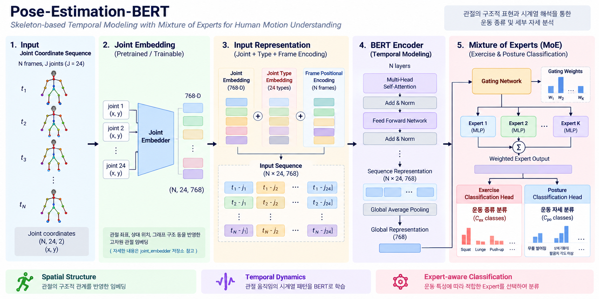

# Pose-Estimation-BERT

## Overview

연속된 프레임의 **인체 관절 좌표를 기반으로 운동 종류와 세부 자세를 분석하는 Human Motion Understanding 모델**입니다.

각 관절 좌표를 Joint Embedder를 통해 고차원 representation으로 변환하고, 관절 종류와 프레임 순서 정보를 추가하여 BERT 기반 Transformer Encoder에 입력합니다. Self-Attention을 통해 **관절 간 관계와 시간에 따른 움직임을 학습**하고, 최종적으로 **Mixture of Experts (MoE)** 구조를 활용하여 운동 종류 및 세부 자세를 분류합니다.

---

## Architecture

<p align="center">
  
</p>

**Joint Coordinate Sequence → Joint Embedding → BERT Encoder → Global Average Pooling → Mixture of Experts → Exercise & Posture Classification**

---

## Joint Representation

각 프레임에서 추출된 관절 좌표를 **Joint Embedder**를 통해 고차원 representation으로 변환합니다.

Joint Embedder는 단순 `(x, y)` 좌표뿐만 아니라 관절 간 상대 위치와 Skeleton 구조를 활용하여 각 관절의 구조적 특징을 표현합니다.

```text id="ezt2qy"
Joint Coordinate
       │
       ▼
 Joint Embedder
       │
       ▼
Joint Representation
```

> Joint Embedder에 대한 자세한 내용은 [Joint Embedder Repository](https://github.com/seojeongyun/joint_embedder)를 참고하세요.

---

## BERT-based Temporal Modeling

연속된 프레임에서 생성된 Joint Representation을 sequence로 구성하여 **BERT 기반 Transformer Encoder**에 입력합니다.

### Input Representation

BERT에 입력되는 representation은 다음 정보를 결합하여 구성합니다.

```text id="vblzct"
Joint Representation
        +
Joint Type Embedding
        +
Frame Positional Encoding
        │
        ▼
    BERT Encoder
```

* **Joint Representation** — 관절 좌표 및 Skeleton 구조 정보
* **Joint Type Embedding** — Shoulder, Elbow, Wrist 등 관절 종류 정보
* **Frame Positional Encoding** — 각 관절이 속한 프레임의 시간 순서 정보

이를 통해 각 token이 **어떤 관절인지**, 그리고 **동작 sequence의 어느 시점에 해당하는지**를 함께 표현합니다.

### Transformer Encoder

Multi-Head Self-Attention을 통해 전체 sequence의 관절 representation 사이의 관계를 학습합니다.

이를 통해 모델은 다음과 같은 정보를 함께 고려할 수 있습니다.

* 동일 관절의 시간에 따른 움직임
* 서로 다른 관절 사이의 위치 및 움직임 관계
* 연속된 자세 사이의 temporal dependency
* 전체 동작에서 나타나는 관절 움직임 패턴

따라서 개별 프레임의 자세뿐만 아니라 **관절의 공간적 관계와 시간적 변화 패턴을 함께 모델링**합니다.

---

## Mixture of Experts

BERT Encoder에서 추출한 sequence representation을 기반으로 **Mixture of Experts (MoE)** 구조를 적용하여 운동 종류와 세부 자세를 분석합니다.

```text id="3w17xk"
              BERT Representation
                       │
                       ▼
                   Gating
                       │
              ┌────────┼────────┐
              ▼        ▼        ▼
           Expert 1  Expert 2  Expert N
              │        │        │
              └────────┼────────┘
                       ▼
              Weighted Output
                       │
              ┌────────┴────────┐
              ▼                 ▼
       Exercise Class       Posture Class
```

### Experts

각 Expert는 BERT에서 추출된 동작 representation을 서로 다른 관점에서 처리합니다.

운동 종류에 따라 필요한 관절 움직임과 자세 특징이 서로 다르기 때문에, 하나의 동일한 classifier만 사용하는 대신 **여러 Expert가 서로 다른 특징을 학습할 수 있도록 구성**합니다.

### Gating Network

Gating Network는 입력 representation을 기반으로 각 Expert의 중요도를 계산합니다.

```text id="mqmtt5"
G(x) = Softmax(Wx + b)
```

각 Expert의 출력은 gating weight를 기반으로 결합됩니다.

```text id="yd5sqr"
MoE(x) = Σ Gᵢ(x) · Expertᵢ(x)
```

이를 통해 입력 동작에 따라 적합한 Expert의 출력을 선택적으로 활용합니다.

### Exercise & Posture Classification

MoE에서 생성된 representation을 기반으로 최종적으로 두 가지 task를 수행합니다.

* **Exercise Classification** — 관절 움직임의 시계열 패턴을 기반으로 운동 종류 분류
* **Posture Classification** — 운동별 관절 위치와 움직임을 기반으로 세부 자세 분류

즉, 전체 구조는 다음과 같은 역할로 구분할 수 있습니다.

```text id="u5e80r"
Joint Embedder
    │
    └─ 관절의 구조적 특징 표현

BERT
    │
    └─ 관절 움직임의 시계열 관계 학습

Mixture of Experts
    │
    └─ 입력 동작에 따른 특징 선택 및 분류

Classification
    │
    ├─ Exercise
    └─ Posture
```

---

## Results

| Task     | Metric    |    Result |
| -------- | --------- | --------: |
| 운동 종류 분류 | Accuracy  | **97.4%** |
| 운동 자세 분류 | Precision | **0.862** |
| 운동 자세 분류 | Recall    | **0.764** |

---

## Key Features

* **Joint Representation Learning** — 관절 좌표와 Skeleton 구조를 활용한 고차원 representation
* **BERT-based Temporal Modeling** — Self-Attention을 통한 관절 및 프레임 간 관계 학습
* **Joint & Frame Encoding** — 관절 종류와 시간 순서 정보를 명시적으로 반영
* **Mixture of Experts** — 입력 동작에 따라 여러 Expert의 출력을 선택적으로 결합
* **Exercise & Posture Analysis** — 운동 종류와 세부 자세를 함께 분석

---

## Tech Stack

`Python` · `PyTorch` · `BERT` · `Transformer` · `Mixture of Experts` · `Human Motion Understanding`
